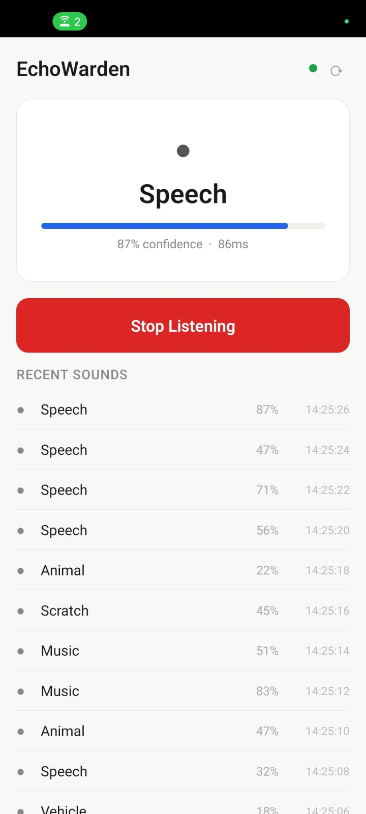
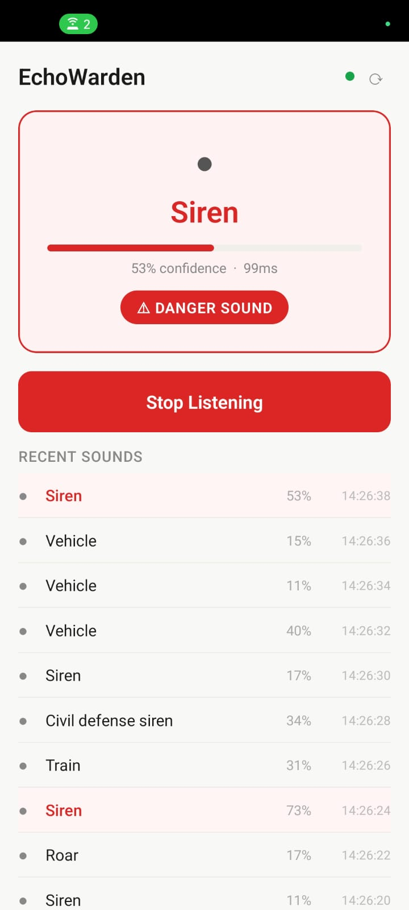
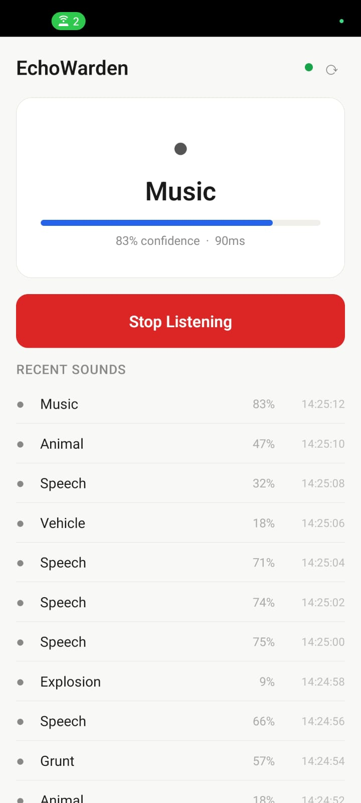
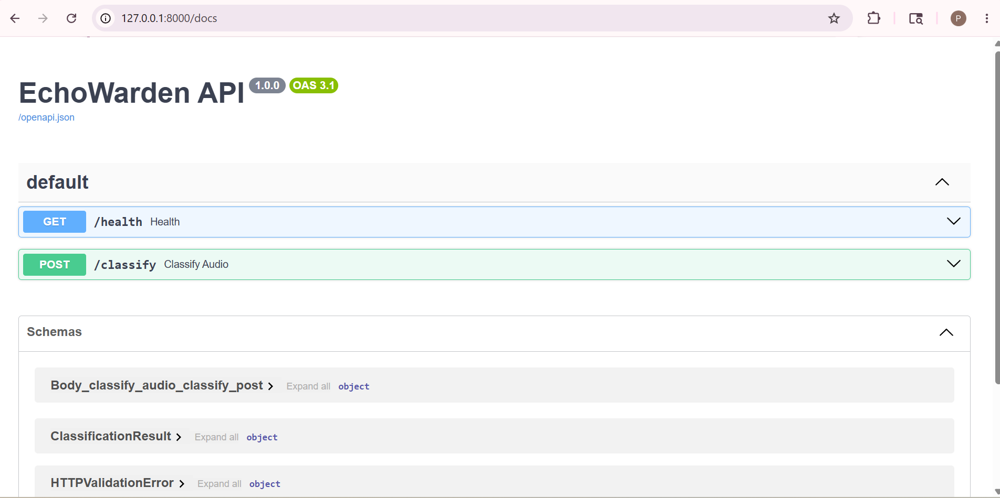
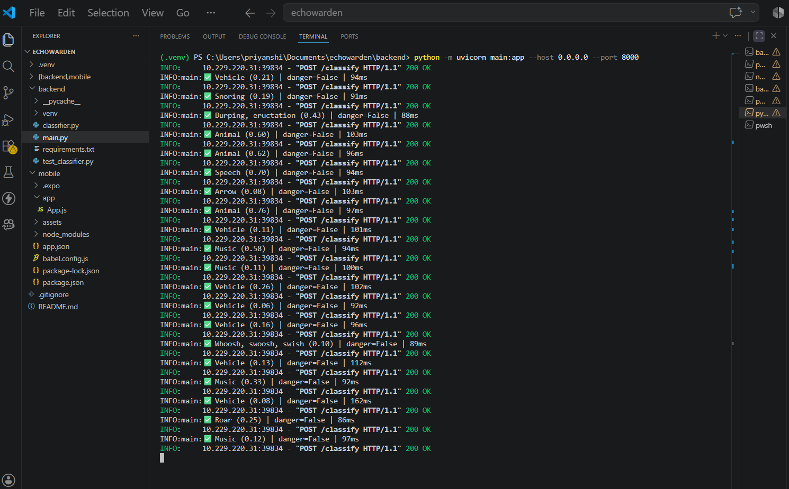

# EchoWarden 🎧

> Real-time environmental audio intelligence for the deaf and hard-of-hearing.

EchoWarden is a mobile + backend system that continuously listens to the environment, classifies sounds in real-time using a pretrained deep learning model, and delivers instant haptic + visual danger alerts — giving deaf and hard-of-hearing users the situational awareness they otherwise miss.

---

## Demo

| Speech Detection | Danger Alert | Recent Sounds Log | API Docs |
|---|---|---|---|
|  |  |  |  |

**Server logs during live session:**


---

## What it does

- 🎤 Records 1.5 seconds of audio every 2 seconds from the phone microphone
- 🧠 Sends audio to a FastAPI backend running PANNs (Pretrained Audio Neural Networks)
- 🔊 Classifies 527 AudioSet sound classes — speech, music, dog barking, sirens, glass breaking, and more
- ⚠️ Triggers haptic vibration + red screen flash for danger-class sounds (sirens, screams, explosions, crashes)
- 📋 Maintains a real-time event log with timestamps
- 🟢 Shows live server connection status

---

## Architecture

```
Android Phone (Expo Go)
    │
    │  Audio (POST /classify)
    ▼
FastAPI Backend (Python)
    │
    │  PyAV decodes any audio format
    ▼
PANNs Cnn14 Model (PyTorch)
    │
    │  527-class AudioSet classification
    ▼
JSON response → Phone UI → Haptic alert if danger
```

---

## Tech Stack

**Backend**
- Python 3.12
- FastAPI + Uvicorn
- PANNs (Pretrained Audio Neural Networks) — Cnn14 model
- PyTorch (CPU inference)
- PyAV (audio decoding — handles mp4, m4a, wav, aac)
- NumPy

**Mobile**
- React Native (Expo SDK 51)
- expo-av (microphone recording)
- expo-haptics (danger vibration alerts)
- react-native-safe-area-context

---

## Project Structure

```
echowarden/
├── backend/
│   ├── main.py              ← FastAPI server
│   ├── classifier.py        ← PANNs model wrapper + danger classes
│   ├── test_classifier.py   ← Validation script
│   └── requirements.txt
├── mobile/
│   ├── app/
│   │   └── App.js           ← Complete React Native UI
│   ├── app.json
│   ├── package.json
│   └── babel.config.js
├── screenshots/
└── README.md
```

---

## Setup & Running

### Prerequisites
- Python 3.10+
- Node.js 18+
- Android phone with Expo Go installed
- Both phone and laptop on the same WiFi network (or USB tethering)

---

### Backend Setup

```bash
# 1. Navigate to backend
cd backend

# 2. Create and activate virtual environment
python -m venv venv

# Windows PowerShell
venv\Scripts\activate

# Mac/Linux
source venv/bin/activate

# 3. Install dependencies
pip install -r requirements.txt

# 4. Install PyTorch (CPU version)
pip install torch --index-url https://download.pytorch.org/whl/cpu

# 5. Install PyAV (audio decoder)
pip install av

# 6. Download PANNs model files
python -c "
import os, urllib.request
os.makedirs(os.path.expanduser('~/panns_data'), exist_ok=True)
urllib.request.urlretrieve(
    'https://raw.githubusercontent.com/qiuqiangkong/audioset_tagging_cnn/master/metadata/class_labels_indices.csv',
    os.path.expanduser('~/panns_data/class_labels_indices.csv')
)
print('CSV downloaded')
"

# Then manually download the model weights (~80MB):
# URL: https://zenodo.org/records/3987831
# File: Cnn14_mAP=0.431.pth
# Save to: C:\Users\<your_username>\panns_data\  (Windows)
#          ~/panns_data/  (Mac/Linux)

# 7. Start the server
python -m uvicorn main:app --host 0.0.0.0 --port 8000
```

Server runs at `http://0.0.0.0:8000`
API docs at `http://localhost:8000/docs`

---

### Mobile Setup

```bash
# 1. Navigate to mobile folder
cd mobile

# 2. Install dependencies
npm install

# 3. Find your laptop's local IP address
# Windows: run `ipconfig` → look for IPv4 Address under WiFi
# Mac/Linux: run `ifconfig` → look for inet under en0

# 4. Edit mobile/app/App.js line 16
const SERVER_IP = "YOUR_LAPTOP_IP_HERE";  # e.g. "192.168.1.42"

# 5. Start Expo
node .\node_modules\@expo\cli\build\bin\cli start   # Windows
npx expo start                                       # Mac/Linux
```

Scan the QR code with Expo Go on your Android phone.

> ⚠️ Your phone and laptop must be on the same WiFi network, OR use USB tethering.

---

### Network Setup (USB Tethering — works without WiFi router)

1. Connect phone to laptop via USB cable
2. On Android: Settings → Hotspot & Tethering → USB Tethering → ON
3. Run `ipconfig` on laptop → find IPv4 under "Ethernet adapter"
4. Put that IP in `App.js` as `SERVER_IP`
5. Start both servers and scan QR

---

## How to Use

1. Start the backend server on your laptop
2. Open EchoWarden on your phone via Expo Go
3. Confirm the green dot (🟢) appears — server is connected
4. Tap **Start Listening**
5. Grant microphone permission
6. Make sounds — talk, clap, play music, or play a siren YouTube video
7. Watch sounds appear in the Recent Sounds log
8. For danger sounds — the screen flashes red and phone vibrates

---

## Danger Sound Classes

EchoWarden classifies these as danger and triggers alerts:

| Category | Examples |
|---|---|
| Emergency | Siren, Ambulance, Fire alarm, Smoke detector |
| Human distress | Screaming, Crying, Shouting |
| Accidents | Glass breaking, Crash, Explosion, Gunshot |
| Traffic | Car horn, Car alarm, Reversing beeps |
| Animals | Dog bark |
| Fire | Fire, Chainsaw |

---

## API Reference

### `GET /health`
Returns server status and whether the PANNs model is loaded.

```json
{"status": "ok", "model_loaded": true}
```

### `POST /classify`
Accepts an audio file (any format), returns classification results.

**Request:** multipart/form-data with audio file

**Response:**
```json
{
  "events": [
    {
      "label": "Speech",
      "confidence": 0.823,
      "is_danger": false,
      "direction": "center"
    }
  ],
  "top_label": "Speech",
  "is_danger": false,
  "latency_ms": 94.2
}
```

---

## Resume Bullet

```
EchoWarden — Real-time environmental audio intelligence app for deaf/HoH accessibility
Built on-device sound event detection system using PANNs (Cnn14) pretrained on AudioSet
(527 classes), served via FastAPI with <150ms end-to-end latency on Android.
Implemented PyAV-based universal audio decoder, danger-class triage layer, and
haptic alert system. Stack: Python, FastAPI, PyTorch, React Native (Expo), PyAV, NumPy.
```

---

## Future Improvements

- [ ] Convert model to TFLite — run fully on-device (no server needed)
- [ ] Crowdsourced soundscape map (pin detected sounds to GPS locations)
- [ ] Wearable haptic bridge via BLE (Arduino / ESP32)
- [ ] Custom danger class editor in the app
- [ ] Direction estimation using binaural mic arrays

---

## Built By

**Priyanshi** — CS Student  
Built in 1 day as a portfolio project demonstrating full-stack ML deployment,
mobile development, and accessibility-focused engineering.

---

## License

MIT — build on it, improve it, ship it.
